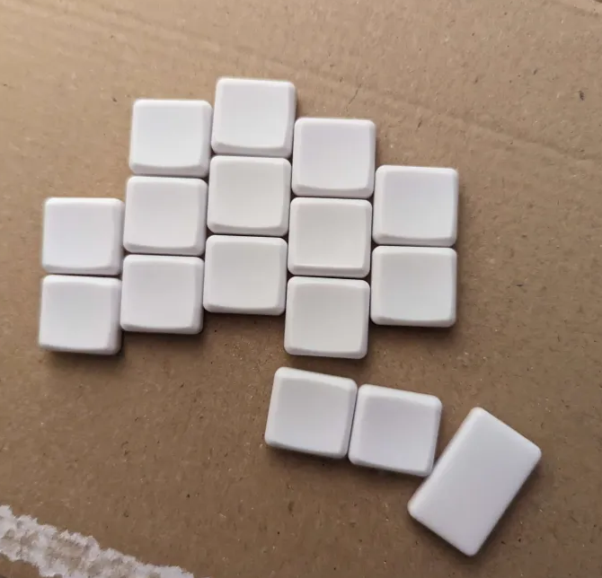
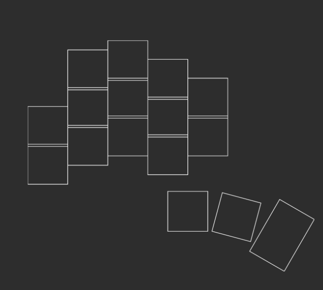
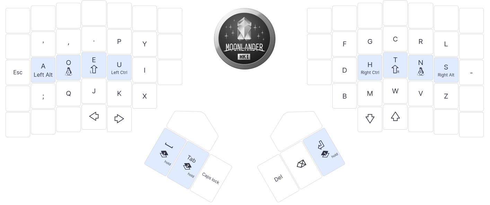

At first, I only wanted to buy a new keyboard because my old one was way past it's time. I started to search for a nice keyboard and as I searched, I slowly fell into the rabbit hole that is mechanical keyboard. After a while, I found split keyboards like the ones bellow.

![image]

At first, I couldn't do anything but laugh at the idea of someone using this weird thing as a keyboard. I continued my quest of the right keyboard™ but could not unsee those weird keyboards. I was intrigued. I wanted to know why someone thought that this would make a good keyboard. and how people were using it. After pondering about it, I decided to buy a Moonlander to try it for myself.

![moonlander]

## Down the rabbit hole

Now with this weird keyboard in my possession, I tried to use it as I would use a normal qwerty keyboard and quickly found out that was not gonna appen.
A usual keyboard is staggered with each row slightly shifted right while the moonlander has a column stagger. That means that each row is aligned in the same way and instead, the columns are shifted up and down to follow a bit your fingers shape. 
This difference made any kind of muscle memory from using a keyboard absolutely useless. I wanted to continue typing on a standard qwerty keyboard if I needed to, on a laptop for example, so I decided to use another layout altogether. There is a lot of layout I could have chosen but I decided to go with Dvorak which is the most well known ~~weird~~ergonomic layout for typing english.

I started using the following layout:
![layout-max-keys]

I was actually surprised by how little you need to move your hand to type sentences with this layout. I really liked the confort of those small movements and started to dislike having to type symbols, numbers or using modifiers like shift or ctrl since they would require a whole hand movement.

Most ergonomic keyboard can be programmed using QMK or ZMK, firmware with way more options than you could think. Those options can help with the previously stated issue: specifically the layers and homerow mods options.
You can think of layers like your shift or alt gr (on international keyboard) key. Holding this layer key while pressing another key will result in a different key being pressed. When you press shift+a, you get A. With a custom layer you could say something like "if i press space+a i get 6". That might sound weird like that but it can allow you to create a symbol or number layer that you can reach while keeping an easy to reach key pressed.
Homerow mods on the other hand is the idea of defining keys that while being hold will act like keeping shift/ctrl/super/alt being hold. Most of the time, you specify keys in the middle of the board, on your homerow, hence the name.

I ended up with this layout:
![layout]

I used this layout without much changes for a years and now that I find myself with a bit of free time, want a wireless and smaller keyboard and want to learn a bit about electronics, I decided to just go and design my own keyboard.

# Designing my own keyboard

I decided to keep most of my current layout but wanted to change the pinky column. It always was the finger that felt stiff the first when typing and thought it required me to move my wrist to reach the upper key. My first idea was to simply lower the pinky column a lot to make it easy to reach the top row but it made it harder to reach the lower one. I finally decided that I would simply remove one row for the pinky, after all, who cares about writing `;` or `z`. 
I also found out that you can use combo keys where pressing two keys at the same time does something else. I thought to myself, "why should I have a `;` key when i can just press both `.` and `,` at the same time to do the same."
While I was at it, I decided to also remove the bottom row for the inner column because it was also a hard key to reach. After playing a bit with keycaps and cardboard, I got to this:

and then used
[ergogen](https://github.com/ergogen/ergogen) to create nice key shapes simply by editing some yml.

## Why?

I used the layout bellow from a moonlander, but I felt the pinky column was way too high, and it was a pain to reach the `l` on the right hand.
I also did not use a lot of the keys and wanted to learn a bit of electronics, so I decided to create a keyboard.

<!-- vim: wrap -->
