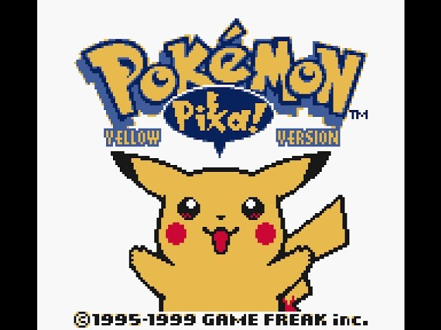
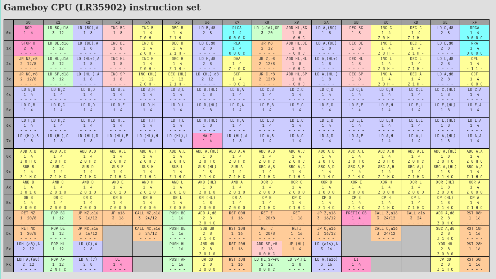
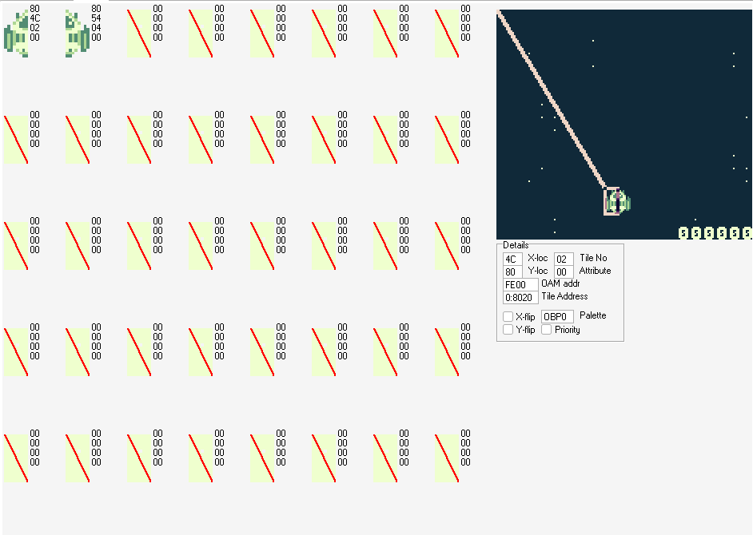
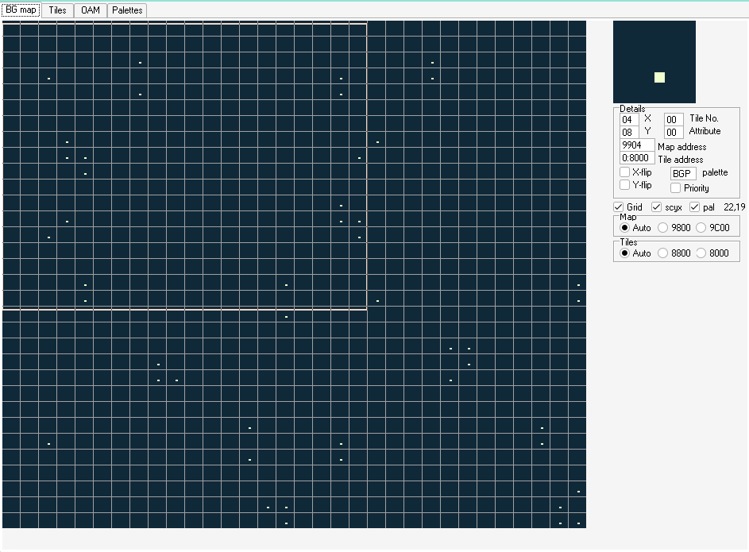
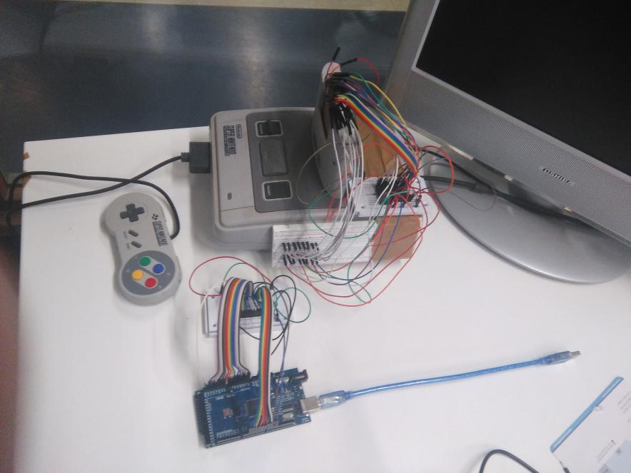

I recently mentioned on Twitter that I made a gameboy game with some friends during my first year of college. Since there's some cool stuff to showcase, here's a blog about it!

## Context

This is some context to explain why we decided to make a gameboy game and a bit of background, if you don't care feel free to directly skip to [the first paragraph](#how-does-it-work).

### Introduction

All courses in the first year of my college were in C so it was common for students to have low-level side projects. Some friends two years older were doing a gameboy emulator. It looked incredibly fun, they would barge in the room with their laptop in hand like "LOOK IT WORKS" and you would see a Pikachu in the screen, saying a BAURHAU because the sound system was broken.



Naturally, I was hyped and decided to also make an emulator with some friends: a SNES one. This project is completely unrelated to this story, but that's how we learned how assembly & retro games worked. While this was not the same CPU, we made a disassembly and implemented instructions, learned about DMA & some hacks that games abused to run on limited hardware. Btw if you're interested, checkout [Retro Game Mechanics Explained](https://www.youtube.com/@RGMechEx) on youtube, especially his [SNES series](https://www.youtube.com/playlist?list=PLHQ0utQyFw5KCcj1ljIhExH_lvGwfn6GV) which is phenomenal.

### Why a gameboy game?

We had a teacher that pushed us to do as much crazy stuff as possible (that's how I ended up making a xml parser in C for a game project...) Since the game jam war organized by the school, he started teasing our friends saying stuff like "for the game jam, you're going to make a gameboy game, right?". Of course, he was not serious, but the idea was already growing in our heads. We decided to make this game with our group of 6. One of us thought this would be a huge failure and refused to work on the asm side. He instead thought it would be cool to make a real cartridge that could run roms in a real hardware.

The game jam started, we had a weekend to make our game. The theme was announced a Friday at 18h, and we needed to make a keynote/presentation of the game on the Monday morning (even if we failed). We had access to everything in the school 24/24, even the electronics stuff. The theme for this jam was `Space`.

Since we wanted to make the simplest game possible, it didn't take us long (approximately 10ms) to settle on the game idea: a space shooter.


### Space shooter

We wrote on a whiteboard what we wanted to do and started working. At the end of the weekend, the board looked like this:


Here's the same board but in text & English:

| Must                                  | Should                         | Could     |
| :------------------------------------ | :----------------------------- | :-------- |
|  Move             |  Game over | ~multi~   |
|  Obstacle         |  Music     | ~Colors~  |
|  Shoot            | Enemies can shoot              | Power ups |
|  Moving obstacles | Lifes                          |           |
|  SFX              | ~cant read sorry~              |           |
|  Get hit          | Flash                          |           |
|  Simple menues    |  Boss      |           |
|                                       |  Intro     |           |
|                                       |  Score     |           |

Turns out we overestimated the difficulty of the thing, we made a playable POC before going home (at 2am).

## How does it work

### CPU stuff

It might sound complicated, but you don't have much to understand in order to write code. We have less than 256 instructions. Once you dedup via parameters (because `increment register a` is a different instruction than `increment register b`), you end up with only 44 instruction types (and that's counting the 13 bitshift instructions & the 7 interrupt instruction [like `stop` that stops the CPU]).



<br>
The gameboy doesn't have an OS. This means you don't have to deal with syscalls or to share memory. Allocating memory become easier:

 - You look at `constant.asm` which can look like (note that `$` means hexadecimal):

   ```asm
   ; Game registers
   DEF FRAME_COUNTER EQU $C000
   DEF HARDWARE_TYPE EQU $C001
   DEF RANDOM_REGISTER EQU $C002
   DEF PLAYER_STRUCT EQU $C003
   ```

 - You find an empty address (like `$C005` for example, because `PLAYER_STRUCT` takes 2 bytes).
 - You shoot in the room "Is `$C005` taken?", if nobody answers add a line in `constant.asm` like

   ```asm
   DEF BOSS_DEATH_COUNTER EQU $C005
   ```
   congratulation you just alloced memory (forever). Until you merge your code, you must inform others that your address is used.

Jokes aside, this means you can write at any arbitrary addresses so your struct or variables are just magic addresses.

<br>
This logic is applied everywhere, since everything is memory mapped.


You are probably used to see address and assume that it's a somewhere on the RAM. This is not true for the gameboy, addresses between `$C000` and `$DFFF` are in RAM. The others are somewhere else (others addresses can also refer to the ram as you can see from the table above).

If you want to read an asset from your game cartridge, you can just use an address between `$0000` and `$3FFF`. There is no file syscall or anything like that.


### PPU stuff

There's no GPU or fancy graphic system, the gameboy (and most consoles of the time) had a PPU instead: a `Picture Processing Unit`. This thing can display sprite, background and even palettes/colors if you are on a gameboy color.

This works by interpreting the VRAM as tiles of 8x8 pixels with a color depth of 4 colors/gray shade.


You can then place those tiles in 3 different ways:
 - either as part of the background
 - as a floating sprite on top of the background (but you can't have only 3 colors that way since one is transparent)
 - as an overlay of both called the `window`

I'll start by explaining sprites. We can place up to 40 tiles wherever we want on the screen. To instruct the PPU to draw sprites, a special part of the memory called `OAM` (meaning `Object Attribute Memory`) is used (between `$FE00` and `$FE9F`).

You can imagine this memory to just be an array of properties. In C it would look like that:

```c
typedef struct object_attribute {
    uint8_t y;
    uint8_t x;
    uint8_t tile_number;
    flags_t flags;
} object_attribute_t;

object_attribute_t oam[40] = 0xFE00;
```

The `tile_number` is just the index of tile you want to display. There are some flags to flip the tiles or other things, but it's mostly used on the gameboy color to specify color palettes.



Next up are the background and window!




Here you can see the whole background of the game. A 32x32 grid of tiles (so 256x256 pixels). To know which tiles to display, the PPU simply look at a part of the VRAM we call the `Background Tile Map` (from `$8000` to `$8FFF`). Each byte is simply the id/index of the tile you want to display.

We can move the camera over this background by setting the `SCX` and `SCY` registers (aka `scroll x` and `scroll y`). The camera will show a 160x144 pixel area and will wrap around the background if necessary (if part of the background goes off-screen, it will appear on the opposite side of the screen).



You might have guessed but the `SCX` and `SCY` registers are of course memory mapped, meaning to set them you just need to write at `$FF43` and `$FF42` respectively. In c, it would be something like:

```c
uint8_t *scroll_x = 0xFF43;
*scrool_x = 12; // set scrool to 12 (or whatever value you want)
```




This means, we can fake a moving spaceship by simply placing a sprite in the middle of the screen and changing the scroll registers.

<video src="scroll.mp4" controls>
</video>

In this video, you can see the game on the right and the complete background rendered on the left. The box you can see moving is the camera's viewport (it moves because we are incrementing the `SCY` register).

You already know how the spaceship is drawn, but we haven't talked yet how we are drawing the score! That's where the `window` comes into play. The window is basically another background that overlaps the default background. We can specify an offset from the top left corner (using the `WX` and `WY`) registers to prevent covering completely the background. We just specified to draw tiles that represent `0` on there.

## Cool parts

Now that you have an overview of how the gameboy works, I'm going to explain how some components work.

### Asteroids & random

To generate obstacles, we need a pseudo random number generator. And of course, no such thing exists on a gameboy. To remediate this, we can use the timing registers that are available. For example, the divide register `DIV` is just a value at `$FF04` that gets incremented automatically (at a rate of 16384Hz if you want details).

We can use it to make a little function like

```asm
; Generates a pseudo random number.
; Params:
;    None
; Return:
;    a -> The number generated
; Registers:
;    af -> Not preserved
;    bc -> Preserved
;    de -> Preserved
;    hl -> Preserved
random::
	push hl

	ld a, [RANDOM_REGISTER]
	ld hl, DIV_REGISTER
	add a, [hl]
	ld [RANDOM_REGISTER], a

	pop hl
	ret
```

In pseudocode, this can look like:

```rust
// The value at this address is the `DIV` register.
// It gets automatically incremented.
u8 *DIV = 0xFF04;
// Just a global that is stored in the RAM.
u8* RANDOM = 0xC003;

fn random() {
  let old_hl = register.hl;
  
  registers.a = *RANDOM;
  registers.hl = DIV;

  // Adds to a the value of the `DIV` register.
  regsiter.a += *registers.hl;

  // Update the random register so we can use it next time.
  *RANDOM = registers.a;

  // Restore the HL register.
  // This way other functions don't need to worry about losing it
  register.hl = old_hl;
}
```

I'll skip the asteroid & collisions detection logic that is pretty basic and let you experience the game at the end.

### Score

Displaying a score might sounds like a very simple feature, but there's more than meets the eyes.

Since the gameboy doesn't have a default font, you need to have tiles for number & letters. We placed them in the VRAM with the same offset as ASCII letters and numbers to have a simple way of displaying strings (you can see this in the tile viewer in the [#ppu-stuff](#ppu-stuff) section). This system allows a simple way to display strings but what about numbers? The obvious way would be to have a recursive function like:

```rust
fn write_number(number: u8) {
  if number > 10 {
    write_number(number / 10)
  }
  write('0' + number % 10);
}
```

There's just a little problem with this approach: the gameboy **doesn't have divisions** (nor multiplications btw). 

When we want a number to be displayed we instead store the number in BCD (Binary-Codec Decimal) format. This format stores each digit of a decimal number in 4 bits. Meaning `45` (in decimal) would be stored as 4 (so `0b0100`) and 5 (so `0b0101`). Since we work with 8 bits values, we can store two digits per value so `45` becomes `0b0100_0101`, coincidentally this number is represented as `$45` in hexadecimal.

To manipulate BCD numbers, the gameboy has a `DAA` instruction that we can use after an arithmetic instruction to convert our register back to a BCD number. Here's an example:

```asm
ld a, $19 ; equivalent of a = 0x19 (19 being a BCD number)
add a, $3 ; equivalent of a += 3
; now, a = 0x1C.
daa ; fixes our register `a` for it to become a BCD number again
; now, a = 0x22
```

Now that all the numbers we want to display are in BCD format, displaying them become trivial.

<details>

<summary>
    Here is an example implementation of a write number function.
</summary>

```asm
; Write the number in `a` to the address `de` (in ascii)
; Params:
;    a -> The number to print
;    de -> The address where to write the ascii output (first digit at de, second digit at de+1)
; Return:
;    de -> Modified address to continue writing (you can call writeNumber again w/ a new `a` value to continue writing)
; Registers:
;    af -> Not preserved
;    b  -> Not preserved
;    c  -> Preserved
;    de -> Not preserved
;    hl -> Preserved
writeNumber::
    ld b, a

    swap a
    and a, $F
    add a, '0'
    ld [de], a
    inc de

    ld a, b
    and a, $F
    add a, '0'
    ld [de], a
    inc de
    ret
```

</details>

## Conclusion

I'm pretty happy of what we managed to achieve in a single week-end with this game! We managed to make a super polished space shooter with an introduction cinematic, a boss & some cool music!

Also, I said earlier that we thought it would be cool to play our game on real hardware. So we did:


  
  


It's our very own cartridge that reads the game from an EEPROM. The right image shows the game that segfault!

> As said previously, segfault is not possible on the gameboy but we made a security mechanism when we jump at a weird place in memory to help us debug. This is this security screen that you are seeing in this image.

This catridge can also be used to play on a SNES by using the Super GameBoy!



You can play the game here:

<iframe title="Turbo Space Shooter" width="100%" style="aspect-ratio: 160/144;" allowfullscreen="true" src="https://wasmboy.app/iframe/?rom-url=./space_shooter.gbc&rom_name=TurboSpaceShooter"> </iframe>

Directions: WASD or arrows \
Start: Enter \
Select: Shift \
Shoot (B): X or Backspace

This embed is running thanks to [wasmboy](https://github.com/torch2424/wasmboy)! If it doesn't work, you can also play the game from [here](https://pinkysmile.github.io/SpaceShooterGB/play).
<br/>
<br/>

We actually made another gameboy game in another game jam later that year. This second game is a platformer and is a way harder technical feat (for reasons I'm not going to disclose until a part 2 of this blog).

So go make gameboy games, it's fun and not that hard! See you for part 2!


## References

Resources that helped us make the game or that I used to refresh my memory for this blog:

- Specification: https://bgb.bircd.org/pandocs.htm
- Explanations: https://gbdev.io/pandocs/
- Opcode grid: https://www.pastraiser.com/cpu/gameboy/gameboy_opcodes.html
- Tetris disassembly: https://github.com/osnr/tetris/tree/master

<!-- vim: set wrap: -->
